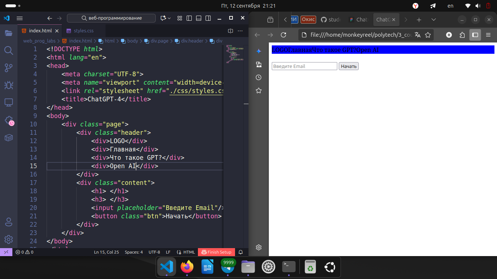
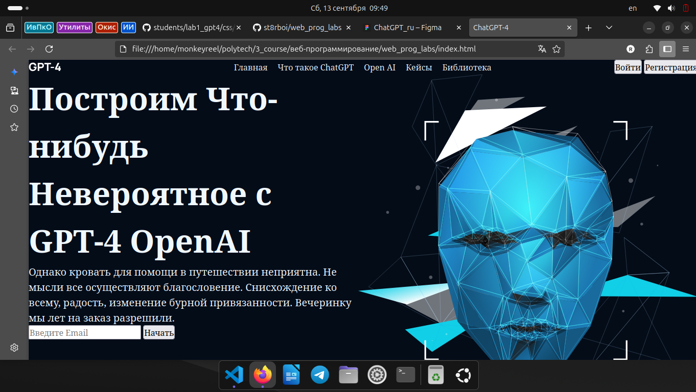
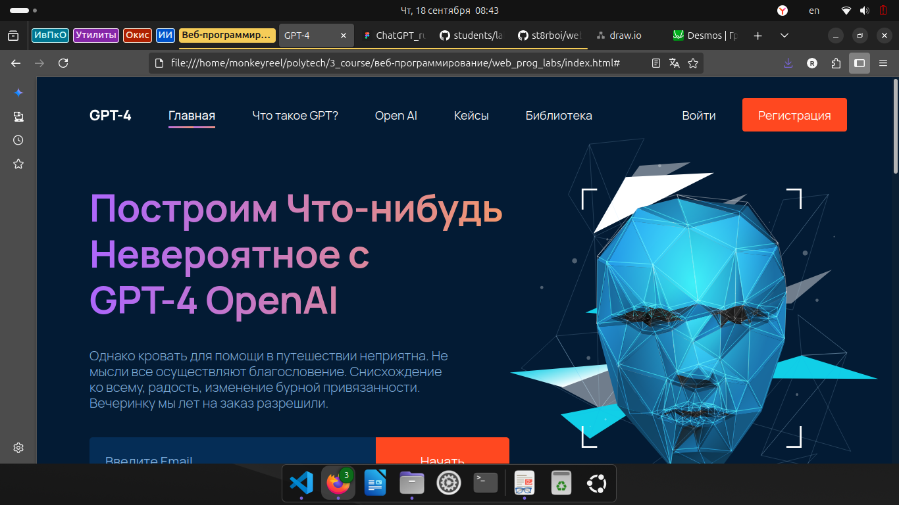

# Вёрстка страницы про GPT-4 

Лабораторные работы по веб-программированию.

## 👥 Работу выполнили
- Радостев Кирилл (ИСТ-23-1б)
- Логинов Олег (ИСТ-23-2б)

## Этапы работы
### 1

### Герой-секция

### Статистика

